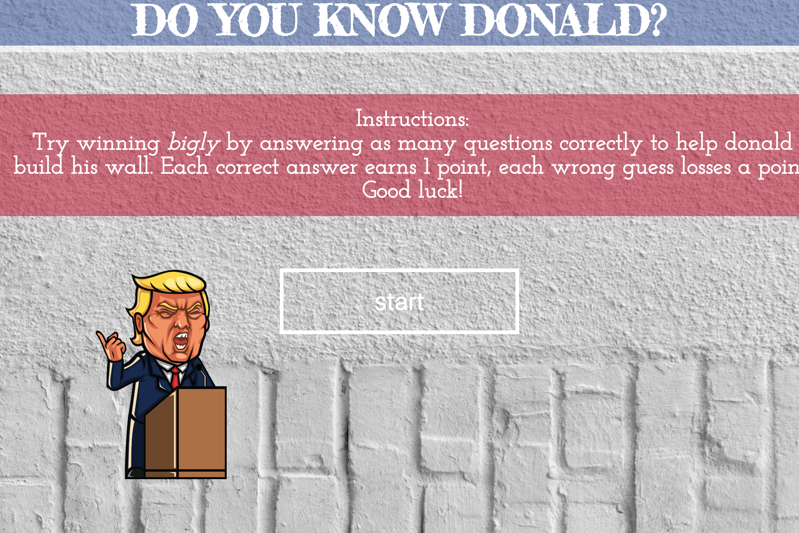

Do You Know Trump Trivia
========================

## How to Play

Click "start" to begin the game. Each question will appear in the red bar. You must select the correct answer in order to move on to the next question. Each question right will add one point to your score and retrieve a random Donald Trump quote or tweet. Each question wrong will subtract a point.
The question number you are on appears on the top left corner, and the score appears in the top right corner. When you are done playing the game, click reset to restart. **you're score will not be reset unless you refresh the page.

## Technologies Used
* HTML
* CSS
* Javascript Vanilla
* APIs

## Installation Instructions
In order to play the game, fork and clone this repository to your computer and open the index.html file,or open the site in your browser.
This game retrieves information from the Tronld Dump API. On some computers, you may have to download the Moesif Cors
extension for your browser to get the quotes to appear.

## About building this game
The code for this game was written in about two days. in order to accomplish this, I started the building the game by working on javascript in logic. Once that was complete, I worked on adding CSS and HTML, and event listeners to make the game more interactive. 
I would like to tweak some things in the mobile version, but am overall satisfied with the outcome.

## Link to Repository
https://github.com/karenheyn/Trump-Trivia

## Link to Page
https://karenheyn.github.io/Trump-Trivia/
